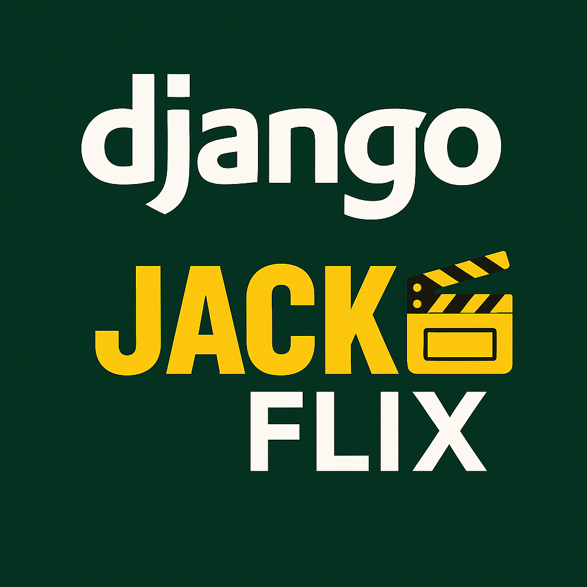
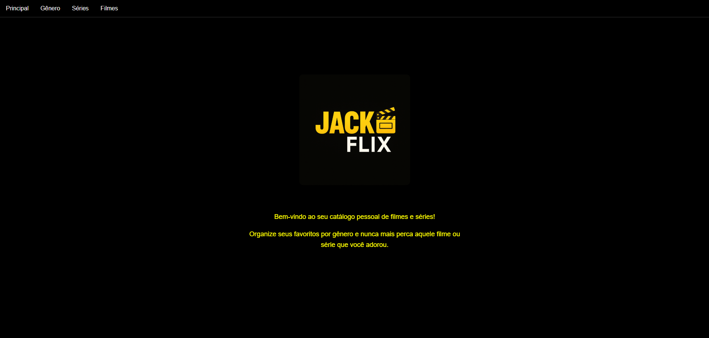
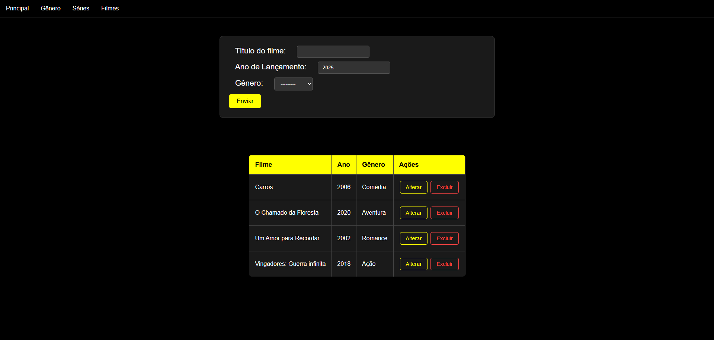
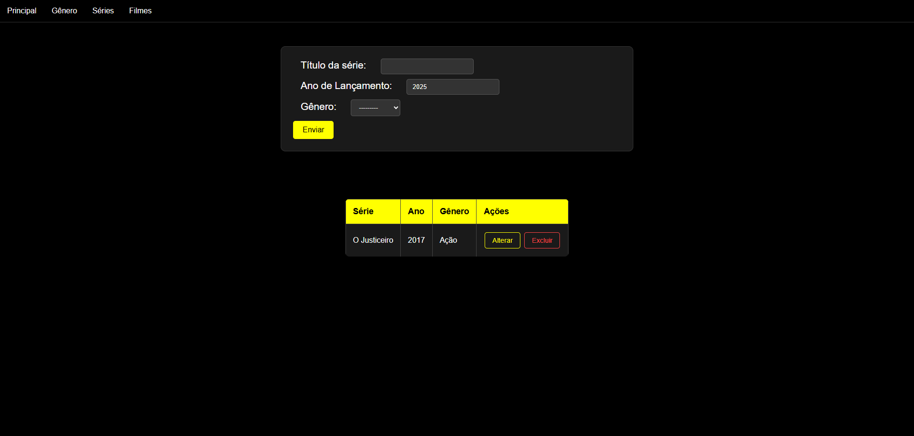

# 🎬 JACKFlix: Sua Plataforma Pessoal de Filmes e Séries










Bem-vindo ao **JACKFlix**! Este projeto é uma aplicação web desenvolvida com Django, pensada para ser o seu cantinho na internet para organizar e catalogar todos os filmes e séries que você ama. Chega de esquecer aquele filme incrível que você queria indicar ou a série que parou na metade!

Este projeto foi criado como parte de um portfólio, demonstrando habilidades em desenvolvimento web full-stack com Python e Django, com foco em boas práticas, design moderno e uma ótima experiência de usuário.

---

## ✨ Funcionalidades Principais

*   **Design Moderno**: Interface escura e elegante, inspirada nas plataformas de streaming mais populares.
*   **CRUD Completo**: Adicione, visualize, edite e exclua gêneros, filmes e séries de forma intuitiva.
*   **Catálogo Organizado**: Liste seus filmes e séries com informações essenciais, como gênero e ano de lançamento.
*   **Interface Responsiva**: Tabelas e layouts que se adaptam para uma boa visualização em diferentes tamanhos de tela.
*   **Banco de Dados Incluso**: O projeto já vem com um banco de dados SQLite populado para demonstração imediata.

---

## 🛠️ Tecnologias Utilizadas

*   **Backend**: Python, Django
*   **Frontend**: HTML5, CSS3, JavaScript
*   **Banco de Dados**: SQLite 3
*   **Containerização**: Docker, Docker Compose
*   **Versionamento**: Git e GitHub

---

## 🚀 Como Executar a Aplicação

Para ter o JACKFlix rodando na sua máquina, você tem duas opções: usando Docker Compose (recomendado) ou executando localmente. Escolha a que preferir!

### **🐳 Opção 1: Usando Docker Compose (Recomendado)**

Esta é a forma mais simples e rápida de executar o projeto, pois não requer instalação de Python ou dependências no seu sistema.

#### **Pré-requisitos:**
- [Docker](https://docs.docker.com/get-docker/) instalado
- [Docker Compose](https://docs.docker.com/compose/install/) instalado

#### **Passos:**

1. **Clone o Repositório**
   ```bash
   git clone <URL_DO_SEU_REPOSITORIO_AQUI>
   cd jackflixweb
   ```

2. **Execute com Docker Compose**
   ```bash
   # Para executar em primeiro plano (ver logs)
   docker-compose up --build
   
   # Para executar em background
   docker-compose up -d --build
   ```

3. **Acesse a Aplicação**
   Abra seu navegador e acesse [http://localhost:8000/](http://localhost:8000/)

#### **Comandos Úteis do Docker Compose:**
```bash
# Parar os containers
docker-compose down

# Ver logs
docker-compose logs -f

# Executar comandos Django dentro do container
docker-compose exec web python manage.py makemigrations
docker-compose exec web python manage.py migrate
docker-compose exec web python manage.py createsuperuser

# Rebuild da imagem (se houver mudanças no Dockerfile)
docker-compose up --build
```

---

### **🐍 Opção 2: Execução Local**

Se preferir executar localmente sem Docker, siga os passos abaixo:

#### **1. Pré-requisitos**

Antes de começar, garanta que você tenha o **Python 3** e o **pip** instalados no seu sistema.

#### **2. Clone o Repositório**

Abra seu terminal, navegue até a pasta onde deseja salvar o projeto e clone este repositório:

```bash
git clone <URL_DO_SEU_REPOSITORIO_AQUI>
cd jackflixweb
```

#### **3. Crie e Ative um Ambiente Virtual (Virtual Environment)**

É uma ótima prática usar um ambiente virtual para isolar as dependências do projeto.

```bash
# Criar o ambiente virtual
python -m venv venv

# Ativar o ambiente (Windows)
.\venv\Scripts\activate

# Ativar o ambiente (Linux/Mac)
source venv/bin/activate
```

#### **4. Instale as Dependências**

Com o ambiente virtual ativado, instale todas as bibliotecas necessárias que estão listadas no arquivo `requirements.txt`.

```bash
pip install -r requirements.txt
```

#### **5. Execute o Servidor!**

Pronto! Agora é só ligar o servidor de desenvolvimento do Django:

```bash
python manage.py runserver
```

Abra seu navegador e acesse [http://127.0.0.1:8000/](http://127.0.0.1:8000/). O JACKFlix estará lá, esperando por você!

---

## 🗄️ Banco de Dados e Migrações

Este projeto já inclui um arquivo de banco de dados `db.sqlite3` com alguns dados para facilitar a visualização e os testes. Assim, você não precisa se preocupar em cadastrar tudo do zero.

### **Se precisar fazer alterações nos modelos...**

Caso você queira evoluir o projeto e modificar os modelos (os arquivos `models.py`), será necessário atualizar o banco de dados. Para isso, use os seguintes comandos:

#### **Com Docker Compose:**
```bash
# Criar as migrações
docker-compose exec web python manage.py makemigrations

# Aplicar as migrações
docker-compose exec web python manage.py migrate
```

#### **Localmente:**
```bash
# Criar as migrações
python manage.py makemigrations

# Aplicar as migrações
python manage.py migrate
```

Isso manterá seu banco de dados sempre sincronizado com o seu código.

---

## 🐳 Informações sobre Docker

O projeto inclui os seguintes arquivos para containerização:

- **`Dockerfile`**: Configuração da imagem Docker usando Debian 11
- **`docker-compose.yml`**: Orquestração dos serviços
- **`.dockerignore`**: Arquivos excluídos do build

### **Vantagens do Docker:**
- ✅ Ambiente isolado e reproduzível
- ✅ Não precisa instalar Python ou dependências localmente
- ✅ Fácil deploy em qualquer ambiente
- ✅ Configuração de desenvolvimento padronizada

---

Aproveite para explorar e customizar o projeto. Feliz codificação! 🚀
